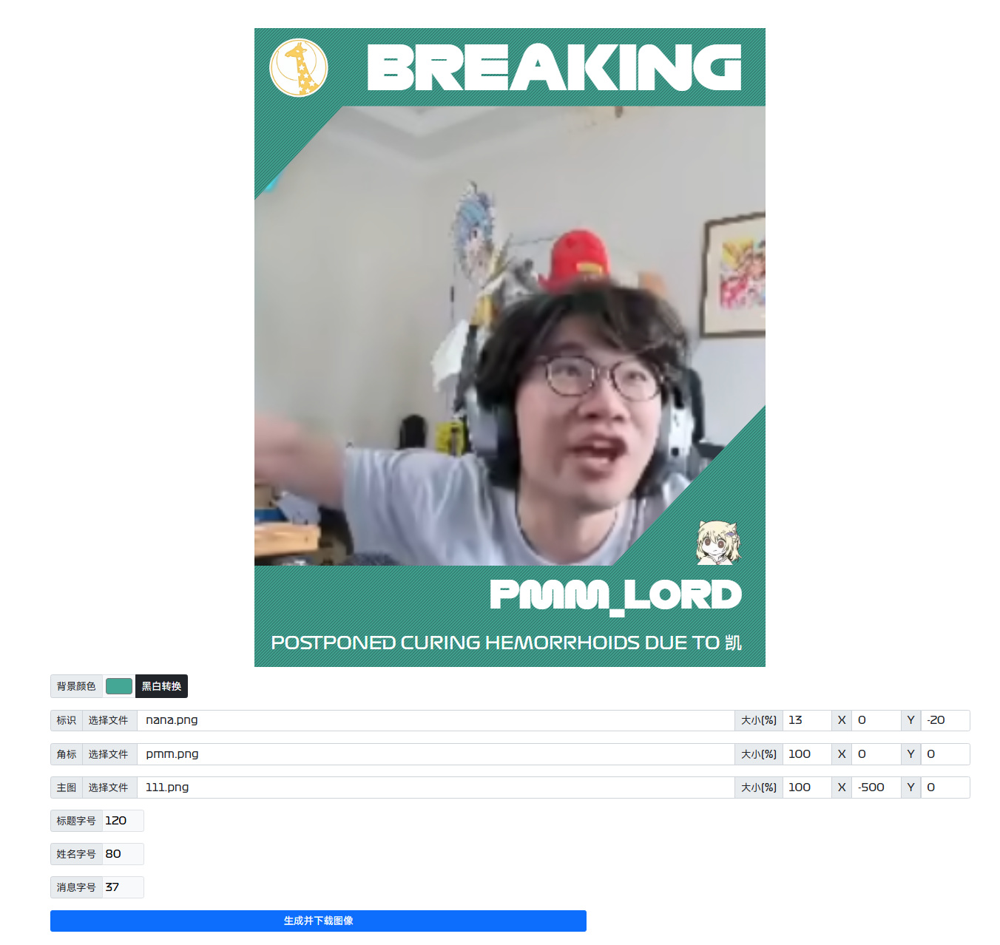

# F1 Breaking 新闻生成器

## 示例

**竖版：**

**横版：**

## 鸣谢

- 原项目[F1-Breaking-Generator](https://github.com/Jay-Young/F1-Breaking-Generator)，本人仅仅为了自身的需求进行了一些特化。

- 本项目由[poodrig](https://poodrig.com/f1news)的项目魔改而来，在此表示感谢。

## 声明

本项目仅供 HTML + CSS 学习测试，部分素材版权归 F1 及相关厂商和车手所有。

## 具体修改

- 提供 `diy.html` 文件，允许用户用自己提供的图片自定义生成的 F1 新闻。
- 支持自定义 F1 Logo、车队 Logo、车手图片、车手姓名、事件描述等。（其实原版携带了部分功能）
- 修复了下载功能，允许用户下载生成的 HTML 文件。
- 删掉了部分的和网页部署相关的内容。目前只允许本地运行。
- 存在的问题：
  - 图标和角标在缩、放时可能会变形。
  - 中文字体和英文字体风格不搭配。
  - `diy.html` 文件中的默认图片不支持下载，请将所有的图片替换为自己的图片。（可以调取素材库）
  - 需要使用 Live Server 或者其他本地服务器来运行 `diy.html` 文件。

### 新示例

出于个人审美和时间问题，只处理了竖版版本。

## 使用方法

打开 `diy.html` 文件，按照页面提示进行操作。

其余文件夹下的文件为原版项目文件。
